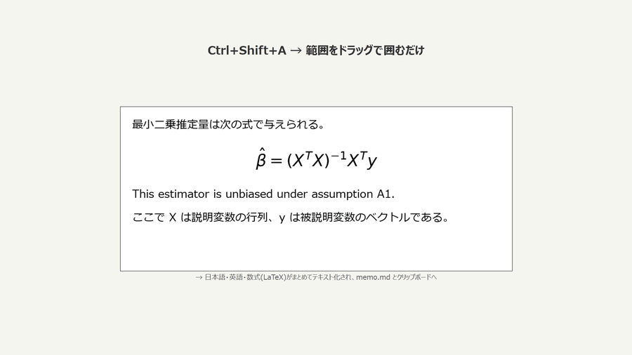

# 画面OCRツール(日本語・英語・数式対応)/ Screen OCR Tool

画面の好きな部分をドラッグで囲むだけで、**日本語・英語・数式(LaTeX)** をテキスト化して
メモファイルに自動追記+クリップボードにコピーする、Windows用の常駐ツールです。

**完全無料・オフライン動作**(初回セットアップ後はネット接続不要)。

## 特徴

- **Ctrl+Shift+X** — 文章モード(日本語+英語、一瞬で認識)
- **Ctrl+Shift+Z** — 数式モード(数式1つをLaTeXに変換)
- **Ctrl+Shift+A** — 混在モード(論文の段落など、文章+数式をまとめて高精度認識)
- 認識結果は `memo.md` に日時付きで自動追記、同時にクリップボードへコピー
- NVIDIA GPUがあれば自動で高速動作(なくてもCPUで動作)
- GPUメモリが逼迫すると自動でメモリを解放(ゲームとの共存)

## 動作環境

| 項目 | 条件 |
|---|---|
| OS | Windows 10 / 11(日本語版) |
| ディスク空き | 8GB程度 |
| GPU | NVIDIA製を推奨(なくても可。混在モードのみ低速になります) |
| ネット接続 | 初回セットアップ時のみ必要 |

## インストール

1. このフォルダ一式をPCの好きな場所に置く(例: ドキュメント内)
2. **`setup.bat` をダブルクリック**(青い画面が出て自動で進みます。10分前後)
   - Pythonが無ければ自動インストールされます
   - NVIDIA GPUの有無も自動判別されます
3. 完了したら **`start_ocr_tool.vbs` をダブルクリック**で起動
   - 初回起動時のみAIモデル(約1.7GB)が自動ダウンロードされます
   - 画面右下に青い「字」アイコンが出たら準備完了

詳しい使い方は [使い方.md](使い方.md) を参照してください。

## 使用している技術

| 認識対象 | エンジン |
|---|---|
| 日本語・英語の文章 | Windows標準OCR |
| 数式 → LaTeX | [RapidLaTeXOCR](https://github.com/RapidAI/RapidLaTeXOCR) |
| 文章+数式の混在(高精度) | [Surya OCR](https://github.com/datalab-to/surya) |

Python / tkinter / PyTorch(CUDA) / ONNX Runtime / マルチスレッド常駐設計

## ライセンス

本ツールのコードは GPL-3.0 で公開しています(依存ライブラリ Surya OCR のライセンスに準拠)。
GPL-3.0 の条件(ソースコードの公開等)の下で自由に利用・改変・再配布できます。
Surya OCR のモデルデータは研究・個人利用および小規模事業者は無料で利用できます
(詳細は [Surya OCRのライセンス](https://github.com/datalab-to/surya#license) を参照)。

## 開発について

要件定義から実装・テストまで、AI(Claude)とペアで開発しました。
設計の詳細は [仕様書.md](仕様書.md) を参照してください。
